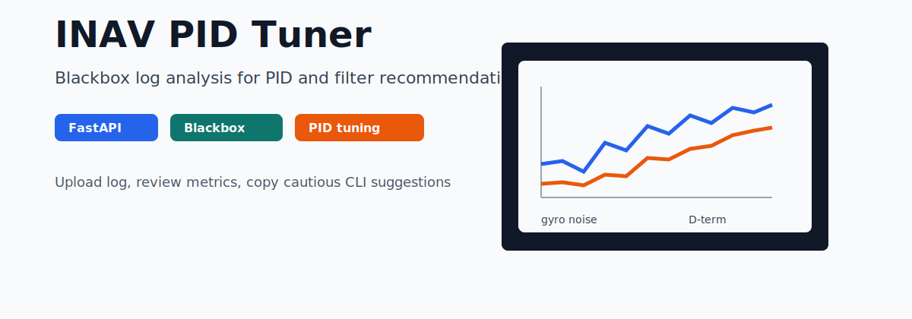

# INAV PID Tuner



[](https://www.python.org/)
[](https://fastapi.tiangolo.com/)
[](https://github.com/19379353560/inav-pid-tuner/stargazers)
[](https://github.com/19379353560/inav-pid-tuner/commits/master)
[](https://github.com/19379353560/inav-pid-tuner/releases/tag/review-2026-04-19)

Analyze INAV Blackbox logs and generate practical PID/filter tuning suggestions.

This is a small FastAPI web tool for FPV builders who tune INAV aircraft from
real flight data. Upload a `.bbl` or `.bfl` Blackbox log, review the extracted
metrics, then copy the suggested CLI changes into INAV Configurator.

Download the [review snapshot](https://github.com/19379353560/inav-pid-tuner/releases/tag/review-2026-04-19)
and see [PROJECT_STATUS.md](PROJECT_STATUS.md) for validation notes. Blackbox
logs, rule suggestions, and tuning feedback are welcome through
[the current Blackbox-log request](https://github.com/19379353560/inav-pid-tuner/issues/1).

## What It Does

- Accepts INAV Blackbox logs in `.bbl` and `.bfl` format.
- Decodes logs through `blackbox_decode`.
- Extracts PID error, D-term noise, and gyro-noise metrics.
- Produces rule-based tuning suggestions for P, I, D-term LPF, and gyro LPF.
- Generates CLI-style output that can be reviewed before applying changes.

## Why It Exists

PID tuning is easier when the decision is tied to real flight data. This tool is
meant to make the first tuning pass less manual by turning Blackbox metrics into
clear recommendations.

It is not a magic auto-tuner. Treat the output as guidance, make small changes,
and always test carefully.

## Requirements

- Python 3.10+
- `blackbox_decode` installed and available in `PATH`
- INAV Blackbox logs from a real flight

Download `blackbox_decode` from:

https://github.com/iNavFlight/blackbox-tools/releases

## Run

```bash
pip install -r requirements.txt
python main.py
```

Open:

```text
http://localhost:8000
```

## Usage

1. Fly your aircraft and save the Blackbox log.
2. Upload the `.bbl` or `.bfl` file.
3. Review the metrics and recommendations.
4. Copy the generated CLI lines into INAV Configurator only after checking them.
5. Fly again and compare the next Blackbox log.

## Current Recommendation Rules

| Signal | What the tool looks for | Suggested direction |
|---|---|---|
| P error RMS | High or unusually low axis error | Increase or decrease P by small steps |
| I error RMS | High accumulated axis error | Increase I by small steps |
| D noise RMS | High D-term noise | Lower D-term LPF cutoff |
| Gyro noise RMS | High gyro noise | Lower gyro LPF cutoff |

## API

The web app exposes one analysis endpoint:

```text
POST /analyze
```

Upload a `.bbl` or `.bfl` file as multipart form data under the `file` field.

## Project Structure

| File | Purpose |
|---|---|
| `main.py` | FastAPI app and upload endpoint |
| `decoder.py` | Blackbox decoding wrapper |
| `metrics.py` | Metric extraction |
| `rules.py` | Rule-based tuning recommendations |
| `frontend/` | Browser UI |
| `tests/` | Test files |

## Related Projects

- [INAV firmware experiments](https://github.com/19379353560/inav)
- [SkyPilot H743 flight controller](https://github.com/19379353560/skypilot)
- [INAV Blackbox tools](https://github.com/iNavFlight/blackbox-tools)

## Feedback Wanted

Useful feedback includes:

- Example INAV Blackbox logs from different airframes.
- Better tuning rules for fixed wing, 5-inch freestyle, and long-range builds.
- UI improvements that make the recommendations easier to review safely.

Start here: [INAV Blackbox log request](https://github.com/19379353560/inav-pid-tuner/issues/1)
or [discussion](https://github.com/19379353560/inav-pid-tuner/discussions/2).

See [ROADMAP.md](ROADMAP.md) for the current validation, analysis, and product
plan.

Related guide: [INAV Blackbox log sharing guide](https://19379353560.github.io/blackbox-log-sharing.html).
